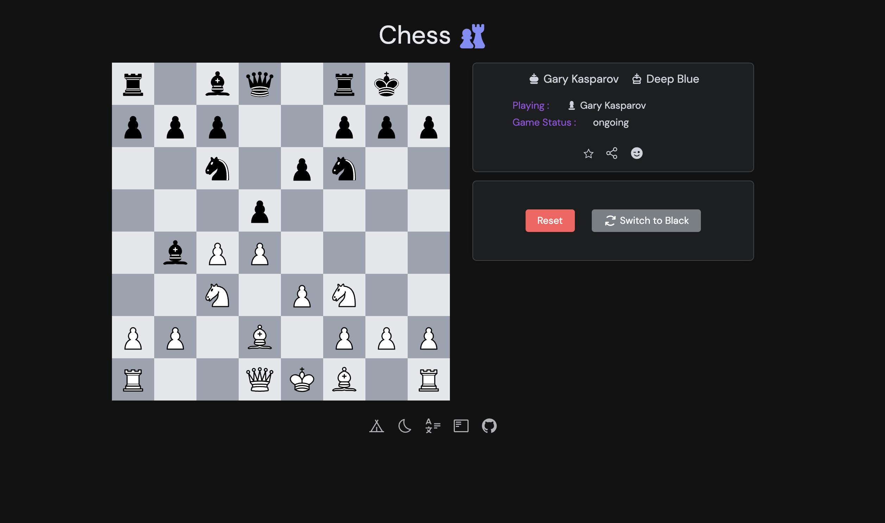

<h1 align="center">  Chess Game web app built with :</h1>

<p align='center'>


<p align='center'>
Based on @antfu's <b> <a href="https://github.com/antfu/vitesse">Vitesse</a></b> <sup><em>(speed)</em> </sup> awesome starter<br/>
Home-made chess engine (see <code> ./src/core</code>) built with <b><a href="https://www.typescriptlang.org/">TypeScript</a></b> <sup><em>(strict mode)</em></sup><br/>
Realtime live games and chat powered by <b><a href="https://supabase.io/">Supabase</a></b> <sup><em>(free tier)</em></sup>
Deployed with <b><a href="https://www.netlify.com/">Netlify</a></b> <sup><em>(free tier)</em></sup>
</p>

<br>

<p align="center">

</p>

<p align='center'>
<a href="https://fastidious-swan-5709df.netlify.app/">Live Demo</a>

</p>

<p align='center'>
you can play with yourself by opening the link in two different tabs and login with demo accounts :
</p>
<div align='center'>
<details>
  <summary>see demo accounts</summary>

alice-at-example-com / testtest <br/>
bob-at-example-com / testtest <br/>
charles-at-example-com / testtest <br/>

</details>

</div>

## Usage

### Supabase

1. Create a new project on [Supabase](https://supabase.io/).
2. Copy the `.env.example` file to `.env` and fill in the values. (see supabase documentation for more info on how to get the values for your project)
3. Set up the required tables and policies either using supabase GUI or by running the following command on supabase query editor:

<details>
  <summary>see sql commands</summary>

```sql

CREATE TABLE users (
  id UUID PRIMARY KEY DEFAULT gen_random_uuid(),
  username TEXT UNIQUE NOT NULL,
  email TEXT UNIQUE NOT NULL,
  created_at TIMESTAMPTZ NOT NULL DEFAULT NOW(),
  updated_at TIMESTAMPTZ NOT NULL DEFAULT NOW()
);


CREATE TABLE games (
  id UUID PRIMARY KEY DEFAULT gen_random_uuid(),
  white_player_id UUID REFERENCES users(id),
  black_player_id UUID REFERENCES users(id),
  status TEXT NOT NULL,
  winner_id UUID REFERENCES users(id),
  created_at TIMESTAMPTZ NOT NULL DEFAULT NOW(),
  updated_at TIMESTAMPTZ NOT NULL DEFAULT NOW()
);

-- RLS Policies for the 'games' table

-- Allow users to create new games
CREATE POLICY games_insert
  ON games FOR INSERT
  WITH CHECK (auth.uid() = white_player_id OR auth.uid() = black_player_id);

-- Allow users to view games they are participating in
CREATE POLICY games_select
  ON games FOR SELECT
  USING (auth.uid() = white_player_id OR auth.uid() = black_player_id);

-- Allow users to update games they are participating in
CREATE POLICY games_update
  ON games FOR UPDATE
  USING (auth.uid() = white_player_id OR auth.uid() = black_player_id);

-- Prevent users from deleting games
CREATE POLICY games_delete
  ON games FOR DELETE
  USING (FALSE);

-- EnableRLS on the `games` table:
ALTER TABLE games FORCE ROW LEVEL SECURITY;


CREATE TABLE game_states (
  id UUID PRIMARY KEY DEFAULT gen_random_uuid(),
  game_id UUID REFERENCES games(id),
  board JSONB NOT NULL,
  move_history JSONB NOT NULL,
  captured_pieces JSONB NOT NULL,
  current_player_id UUID REFERENCES users(id),
  created_at TIMESTAMPTZ NOT NULL DEFAULT NOW(),
  updated_at TIMESTAMPTZ NOT NULL DEFAULT NOW()
);

CREATE POLICY game_states_insert
  ON game_states FOR INSERT
  WITH CHECK (
    auth.uid() IN (
      SELECT white_player_id
      FROM games
      WHERE game_id = games.id
      UNION
      SELECT black_player_id
      FROM games
      WHERE game_id = games.id
    )
  );

CREATE POLICY game_states_select
  ON game_states FOR SELECT
  USING (
    auth.uid() IN (
      SELECT white_player_id
      FROM games
      WHERE game_id = games.id
      UNION SELECT black_player_id
      FROM games
      WHERE game_id = games.id
    )
  );

CREATE POLICY game_states_update
  ON game_states FOR UPDATE
  USING (
    auth.uid() IN (
      SELECT white_player_id
      FROM games
      WHERE game_id = games.id
      UNION
      SELECT black_player_id
      FROM games
      WHERE game_id = games.id
    )
  );

CREATE POLICY game_states_delete
  ON game_states FOR DELETE
  USING (FALSE);

ALTER TABLE game_states FORCE ROW LEVEL SECURITY;

CREATE TABLE chat_messages (
  id UUID PRIMARY KEY DEFAULT gen_random_uuid(),
  game_id UUID REFERENCES games(id),
  user_id UUID REFERENCES users(id),
  content TEXT NOT NULL,
  created_at TIMESTAMPTZ NOT NULL DEFAULT NOW()
);


-- Allow users to send chat messages in games they are participating in
CREATE POLICY chat_messages_insert
  ON chat_messages FOR INSERT
  WITH CHECK (
    auth.uid() IN (
      SELECT white_player_id
      FROM games
      WHERE game_id = games.id
      UNION
      SELECT black_player_id
      FROM games
      WHERE game_id = games.id
    )
  );

-- Allow users to view chat messages in games they are participating in
CREATE POLICY chat_messages_select
  ON chat_messages FOR SELECT
  USING (
    auth.uid() IN (
      SELECT white_player_id
      FROM games
      WHERE game_id = games.id
      UNION
      SELECT black_player_id
      FROM games
      WHERE game_id = games.id
    )
  );

-- Preventusers from updating chat messages
CREATE POLICY chat_messages_update
  ON chat_messages FOR UPDATE
  USING (FALSE);

-- Prevent users from deleting chat messages
CREATE POLICY chat_messages_delete
  ON chat_messages FOR DELETE
  USING (FALSE);

-- Enable RLS on the `chat_messages` table:

ALTER TABLE chat_messages FORCE ROW LEVEL SECURITY;

```

</details>

4. Enable supabase realtime functionalities : <code>database->replications->supabase_realtime </code> : select the above created tables

### Development

Just run and visit http://localhost:3333

```bash
pnpm run dev
```

### Build

To build the App, run

```bash
pnpm run build
```

And you will see the generated file in `dist` that ready to be served.

### CI-CD pipeline with Github actions and Netlify Deploy

1. Create a new project on [Netlify](https://www.netlify.com/)
2. Get your netlify <code>NETLIFY_AUTH_TOKEN</code> and <code>NETLIFY_SITE_ID</code> from your netlify account settings
3. Add the above variables to your github repository secrets

The action defined in <code>/.github/workflows/ci.yml</code> will run on every push to the main branch,<br/> run <code>lint</code>, <code>typecheck</code>, <code>test:unit</code> and <code>test:e2e</code> and will build and deploy the app to netlify 🚀 if all tests pass ✅.
